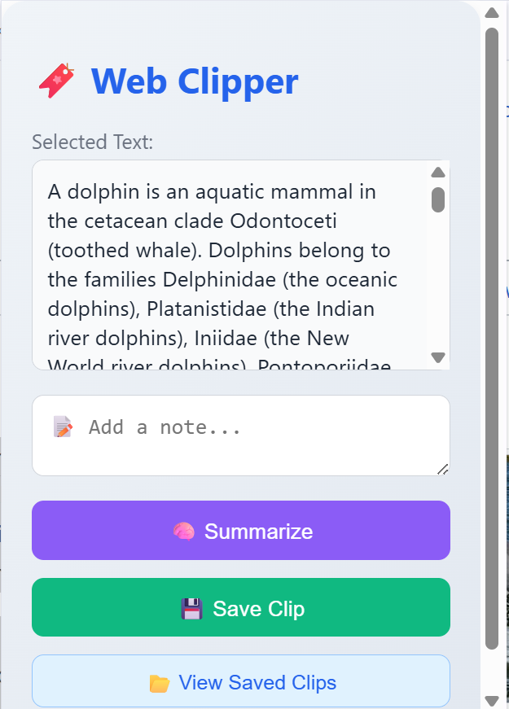
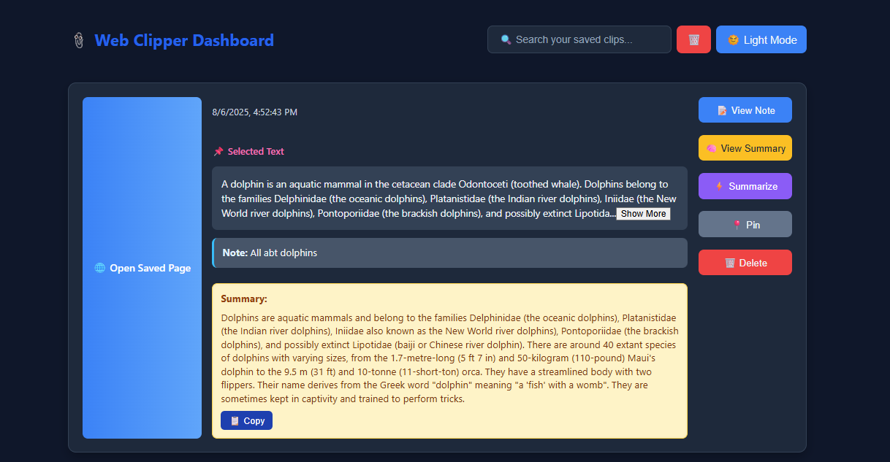

# 🧠 SmartClip - AI-powered Chrome Web Clipper

SmartClip is a Chrome Extension that allows users to:
- Select and clip text from any website
- Add personal notes
- Generate AI summaries using Cohere API
- Save and manage clips via a MongoDB + Node.js backend
- View saved clips in a clean React + Tailwind dashboard

---

## 📦 Features

- 🖱️ Clip text from webpages
- 📝 Add optional notes
- 🤖 AI-powered summarization (Cohere)
- 💾 Save clips to MongoDB via Express backend
- 📂 Manage clips in a responsive dashboard

---

## 🚀 How to Set Up and Use

### 1. Clone the Repository

```bash
git clone https://github.com/YOUR_USERNAME/smartclip-extension.git
cd smartclip-extension
````

---

### 2. Setup Backend

```bash
cd backend
npm install
```

#### 🔐 Get Your Cohere API Key

1. Go to [https://dashboard.cohere.com](https://dashboard.cohere.com)
2. Sign up or log in
3. Copy your API key
4. Create a `.env` file in the `backend/` folder:

```env
COHERE_API_KEY=your_cohere_api_key
MONGO_URI=your_mongodb_connection_string
PORT=5000
```

#### Start the server:

```bash
node server.js
```

---

### 3. Setup Frontend (Chrome Extension)

```bash
cd ..
npm install
npm run build
```

> This will generate a `dist/` folder for your extension.

---

### 4. Load the Extension in Chrome

1. Open Chrome and go to `chrome://extensions`
2. Enable **Developer Mode**
3. Click **Load Unpacked**
4. Select the `dist/` folder

✅ You're ready to use SmartClip!

---

## 📂 Usage

1. Select text on any webpage
2. Open the extension
3. Add a note (optional)
4. Click **🧠 Summarize** to generate AI summary
5. Click **💾 Save Clip** to store
6. Click **📂 View Saved Clips** to open the dashboard
   





---

## 📜 License

This project is licensed under the [MIT License](LICENSE).

